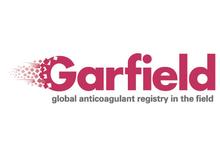

# garfield_prediction_models


Flask Application to create a prediction model tool for the reduced models

## About
GARFIELD is a pioneering outcomes research initiative sponsored and coordinated by the Thrombosis Research Institute. Our worldwide observational programmes enhance understanding of the burden of thrombosis and identify opportunities for the incorporation of innovations designed to improve safety, outcomes and utilization of healthcare resources.

Using the GARFIELD registry, two prediction models were built to aid in predicting two endpoints:
1. Bleeding
2. Stroke

This repository serves as the codebase for the implementation of these two models. The goal is to build two microservices that allow users (both programmatic and GUI-based) to interface with the algorithms in an easy and reproducible manner. These microservices will be built using Python and Docker.

## Environment
We will be using [Docker](https://www.docker.com) to encapsulate and deploy our web app(s). Due to the current state of rocker/docker environments, we will use two images/containers for this project:
1. rocker/rstudio - for development of code
2. rocker/shiny - for hosting the application

Once this repo is cloned and the working directory is set to it's local path, follow these instructions to instantiate the container(s) that host the app:
```
#rstudio server environment
docker build -t rocker/rstudio-garfield .
docker run -d -p 8887:8787 -v $(pwd)/shinyApps:/home/rstudio rocker/rstudio-garfield

#shiny server environment
docker build -f Dockerfile.shiny -t rocker/shiny-garfield .
docker run -d -p 3338:3838 \
--restart=always \
-v $(pwd)/shinyApps:/srv/shiny-server \
rocker/shiny-garfield
```
